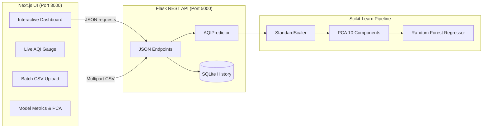

# 🌫️ Air Quality Index Prediction — Random Forest + PCA

[](https://www.python.org/)
[](https://scikit-learn.org/)
[](https://flask.palletsprojects.com/)
[](LICENSE)

An end-to-end, production-grade ML project that predicts **Air Quality Index (AQI)** from pollutant and weather readings using **Principal Component Analysis** for dimensionality reduction and a tuned **Random Forest Regressor** for prediction, served via a modern **Flask + Bootstrap 5** dashboard.

## 📌 Problem Statement
Air pollution is a global public-health emergency. Regulators and citizens need fast, reliable AQI forecasts from raw sensor inputs (PM2.5, PM10, NO₂, SO₂, CO, O₃, meteorology). This project builds a reproducible pipeline that turns those readings into an AQI value, category, and health recommendation.

## 🎯 Objectives
- Clean and preprocess a real-world pollution dataset
- Reduce dimensionality with **PCA** (retain 95% variance)
- Train a **Random Forest** regressor with **GridSearchCV**
- Evaluate with R², Adj-R², MAE, MSE, RMSE, and cross-validation
- Ship a responsive **Flask** UI with single + batch prediction, dark mode, glassmorphism, and a metrics dashboard

## 📊 Dataset
Place any Kaggle AQI dataset at `dataset/AQI.csv` with the columns below. If the file is missing, `preprocessing.py` will **auto-generate a realistic synthetic dataset** so the pipeline runs immediately.

| Feature | Description | Unit |
|---|---|---|
| PM2.5 | Fine particulate matter | µg/m³ |
| PM10 | Coarse particulate matter | µg/m³ |
| NO2 | Nitrogen dioxide | µg/m³ |
| SO2 | Sulphur dioxide | µg/m³ |
| CO | Carbon monoxide | mg/m³ |
| Ozone | Tropospheric O₃ | µg/m³ |
| Temperature | Ambient temperature | °C |
| Humidity | Relative humidity | % |
| WindSpeed | Wind speed | m/s |
| Pressure | Atmospheric pressure | hPa |
| **AQI** | Target variable | 0–500 |

## 🧱 Tech Stack
- **Backend & ML**: Python 3.12 · Scikit-Learn · NumPy · Pandas · Joblib · Flask (Pure JSON API)
- **Frontend Dashboard**: Next.js 15 · React 19 · TypeScript · Tailwind CSS · TanStack Query · Framer Motion · Lucide Icons

## 🚀 Quick Start

### 1. Backend Setup & Training
```bash
git clone https://github.com/<you>/Air-Quality-Index-Prediction.git
cd Air-Quality-Index-Prediction

# Virtual environment
python -m venv .venv && source .venv/bin/activate   # Windows: .venv\Scripts\activate
pip install -r requirements.txt

# Train models (creates scaler.pkl, pca.pkl, random_forest.pkl, metrics.json)
python train.py

# Start Flask JSON REST API (runs on port 5000)
python app.py
```

### 2. Frontend Dashboard UI
In a separate terminal:
```bash
cd frontend
npm install
npm run dev
```
Open **`http://localhost:3000`** in your browser to access the dashboard.

> [!NOTE]
> `http://localhost:5000` serves the backend JSON REST API only (returns health/status JSON). The dashboard interface is exclusively rendered on `http://localhost:3000`.

## 🧪 REST API Endpoints

- **`GET /`** — Health and service status JSON.
- **`POST /api/predict`** — Single-sample AQI inference.
  ```bash
  curl -X POST http://localhost:5000/api/predict \
    -H "Content-Type: application/json" \
    -d '{"PM2.5":90,"PM10":150,"NO":20,"NO2":40,"NOx":50,"NH3":15,"CO":1.5,"SO2":15,"O3":60,"Benzene":2.5,"Toluene":5.0,"Xylene":1.2}'
  ```
- **`POST /api/batch`** — CSV batch prediction (multipart upload returning predictions CSV).
- **`GET /api/metrics`** — Model evaluation metrics & pollutant-level PCA importances.
- **`GET /api/history`** — SQLite-backed prediction history log.

## 🗂️ Project Structure
```
Air-Quality-Index-Prediction/
├── dataset/city_day.csv        # Air quality dataset
├── frontend/                   # Modern Next.js + TypeScript Dashboard UI (Port 3000)
│   ├── src/app/                # App router, layout & global styles
│   ├── src/components/         # Atmospheric gauges, charts, forms & modals
│   ├── src/hooks/              # TanStack Query data-fetching hooks
│   └── src/lib/                # API client configuration
├── models/                     # scaler.pkl, pca.pkl, random_forest.pkl, metrics.json, history.db
├── notebooks/EDA.ipynb         # Exploratory Data Analysis
├── docs/                       # ARCHITECTURE.md, REPORT.md, DEPLOYMENT.md, etc.
├── tests/test_pipeline.py      # Automated smoke & pipeline tests
├── legacy/                     # Archived Jinja2 templates and static assets
├── app.py                      # Flask JSON REST API backend (Port 5000)
├── train.py                    # Model training & hyperparameter tuning
├── predict.py                  # Inference engine (Scaler -> PCA -> RF)
├── preprocessing.py            # Data cleaning, imputation, outlier capping
├── db.py                       # SQLite prediction history persistence
├── utils.py                    # Constants, AQI categories, health advisories
└── requirements.txt            # Python dependencies
```

## 🧠 System Architecture


## 📈 AQI Categories
| Range | Category | Color |
|---|---|---|
| 0–50 | Excellent | 🟢 Green |
| 51–100 | Good | 🟡 Yellow-green |
| 101–200 | Moderate | 🟠 Orange |
| 201–300 | Poor | 🟠 Deep orange |
| 301–400 | Very Poor | 🟣 Purple |
| 401–500 | Severe | 🟤 Dark maroon |

## 📚 Documentation
- [Architecture & Diagrams](docs/ARCHITECTURE.md)
- [Project Report](docs/REPORT.md)
- [Presentation Outline](docs/PRESENTATION.md)
- [Deployment Guide](docs/DEPLOYMENT.md)
- [GitHub Guide](docs/GITHUB.md)

## 🔬 Feature Importance Sanity Check

> Verified 2026-08-25 · dataset: `city_day.csv` (24,850 rows with non-NaN AQI) · script: `sanity_check_correlations.py` · full data: `models/pearson_vs_pca.json`

The model reports **pollutant-level importances** by back-projecting RF component importances through squared PCA loadings. A natural sanity question is: *do those rankings agree with raw correlation with AQI?*

| Rank | Pollutant | Pearson r (AQI) | PCA Importance | PCA Rank | Δ Rank |
|:----:|-----------|:--------------:|:--------------:|:--------:|:------:|
| 1 | PM10 | **+0.803** | 0.1119 | 2 | −1 |
| 2 | CO | +0.683 | **0.1184** | 1 | +1 |
| 3 | PM2.5 | +0.659 | 0.1082 | 3 | 0 |
| 4 | NO2 | +0.537 | 0.0957 | 5 | −1 |
| 5 | SO2 | +0.491 | 0.0652 | 9 | **−4** |
| 6 | NOx | +0.486 | 0.0978 | 4 | +2 |
| 7 | NO | +0.452 | 0.0878 | 6 | +1 |
| 8 | Toluene | +0.280 | 0.0730 | 7 | +1 |
| 9 | NH3 | +0.252 | 0.0636 | 10 | −1 |
| 10 | O3 | +0.199 | 0.0502 | 12 | **−2** |
| 11 | Xylene | +0.166 | 0.0585 | 11 | 0 |
| 12 | Benzene | +0.044 | 0.0699 | 8 | **+4** |

**Key takeaways:**

1. **PM10 outranks PM2.5 in raw correlation (r = 0.80 vs 0.66)** — consistent with the Indian CPCB AQI formula, which publishes a PM10 sub-index that frequently dominates the composite score. Literature that reports "PM2.5 dominates AQI" typically refers to *health-impact* weighting, not the CPCB formula used here.

2. **CO vs PM2.5 in PCA importance (CO=11.8%, PM2.5=10.8%, Δ≈1 pt)** — CO has a marginally higher raw correlation (r=0.683 vs 0.659) *and* loads substantially on multiple mid-variance PCA components (PC5, PC6, PC10) that the RF weights above average. Both factors push CO's squared-loading-weighted importance just above PM2.5. **This is not a bug** — it reflects how CO co-varies with AQI across multiple orthogonal pollution dimensions.

3. **SO2 (Pearson #5 → PCA #9) and Benzene (Pearson #12 → PCA #8)** show the largest rank swings: SO2's signal is spread thinly across low-weight PCA components (diluted); Benzene loads strongly on components that help the RF separate high-pollution episodes even though its direct linear correlation with AQI is near zero.

4. **The ~2-point spread across the top-5 PCA ranks** is a mathematical consequence of orthogonal decomposition across highly correlated pollutants — attribution diffuses because PM2.5, PM10, CO, and NOx are not separable in the original feature space. Neither ranking is wrong; they answer different questions.

## 🌱 Future Scope
Real-time IoT ingestion · LSTM/Transformer time-series forecast · geospatial mapping · SHAP explanations · mobile app.

## 👤 Author
Built with ❤️ as a portfolio-ready reference implementation. MIT licensed.
