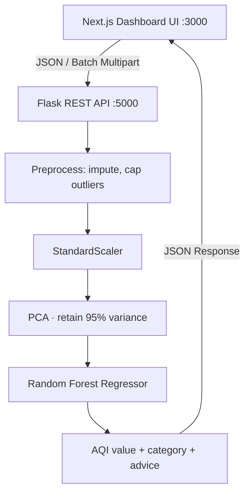
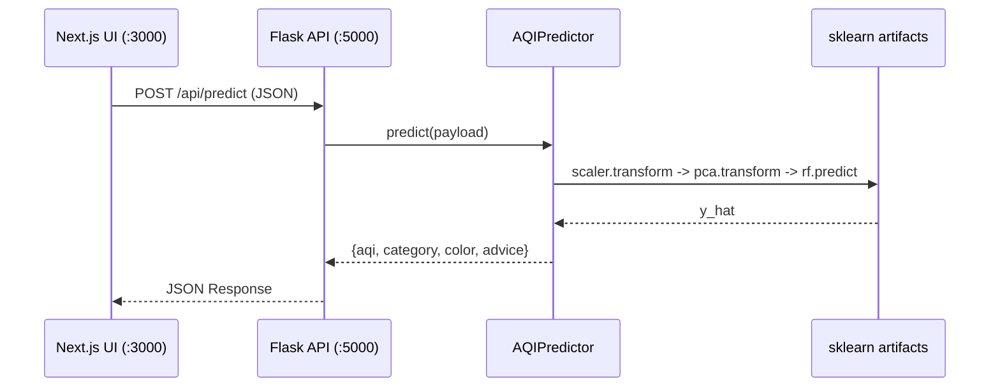
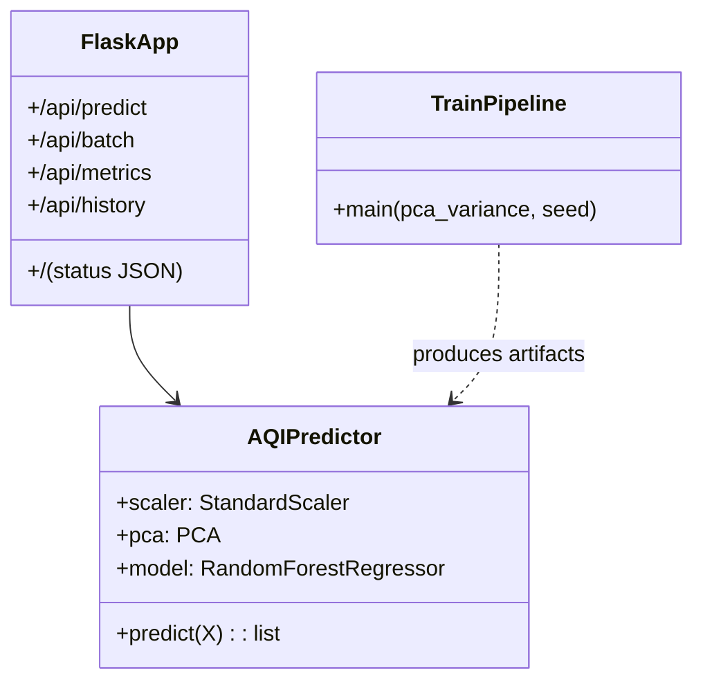

# System Architecture

## High-level pipeline

## Sequence diagram

## Component / UML

## Data flow
1. Ingest CSV → 2. Clean & impute → 3. IQR outlier cap → 4. Scale → 5. PCA → 6. RF prediction → 7. AQI mapping → 8. Response.
